> [实验环境准备](#实验环境准备)
>
> [动手实验](#动手实验)
>
> [考虑](#考虑)

&nbsp;
&nbsp;


## 实验环境准备

1.  实验所需Azure权限

> Azure AD：全局管理员
>
> Azure 订阅：1 个具有所有者权限的订阅。
>
> 管理组：分支或根管理组的"管理组贡献者"权限。

2.  Rover运行环境需要Docker，所以本实验需要在您的本地电脑环境下载并运行[Docker](https://docs.docker.com/get-docker/)

3.  如果还没有[Git](https://git-scm.com/downloads)和[VS Code](https://code.visualstudio.com/download)，请先点击各自链接下载。

4.  Fork包含实验代码（IaC）的RepoRoverStarter项目是一个空环境，可让您开始使用初始配置文件并创建连贯的堆栈。为方便中国合作伙伴访问Rover Starter代码仓库，可以任意选择在[GitHub](https://github.com/Azure/caf-terraform-landingzones-platform-starter)或[Gitee](https://gitee.com/mirrors_Azure/caf-terraform-landingzones-platform-starter)  
    **Fork**到你的Github或Gitee账户下，并设置成私有仓库，用于实验中模拟的IaC代码仓库

    [Github上 Cloud Adoption Framework landing zones for Terraform - Platform startertemplate](https://github.com/Azure/caf-terraform-landingzones-platform-starter)如下：

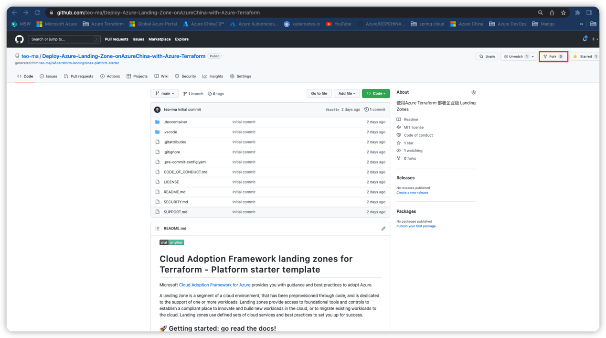

   [Gitee 上Cloud Adoption Framework landing zones for Terraform - Platform starter template](https://gitee.com/mirrors_Azure/caf-terraform-landingzones-platform-starter)如下：


5.  在以下命令行\<org>/\<repo> 位置替换成你的github或gitee仓库地址

    ```bash
    git clone git://github.com/\<org>/\<repo> contoso && cd contoso
    ```
    你应该观察到：

    Cloning into \'contoso\'\...\
    remote: Enumerating objects: 429, done.\
    remote: Counting objects: 100% (429/429), done.\
    remote: Compressing objects: 100% (320/320), done.\
    remote: Total 429 (delta 110), reused 307 (delta 77), pack-reused 0\
    Receiving objects: 100% (429/429), 2.93 MiB \| 1.52 MiB/s, done.\
    Resolving deltas: 100% (110/110), done.

6.  从 contoso 文件夹打开 Visual Studio Code

    ```bash
    code .
    ```

    根据下图提示选择**信任存储库**

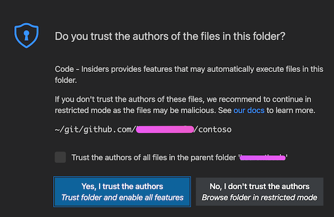


7.  在Visual Studio code打开克隆的存储库并显示以下结构。

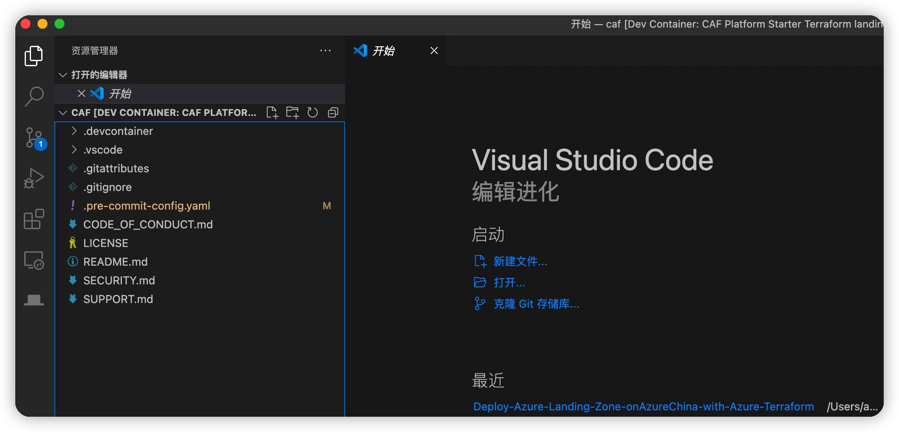

8.  添加VS Code远程开发extension插件。选择**Remote --Containers**插件并单击安装。

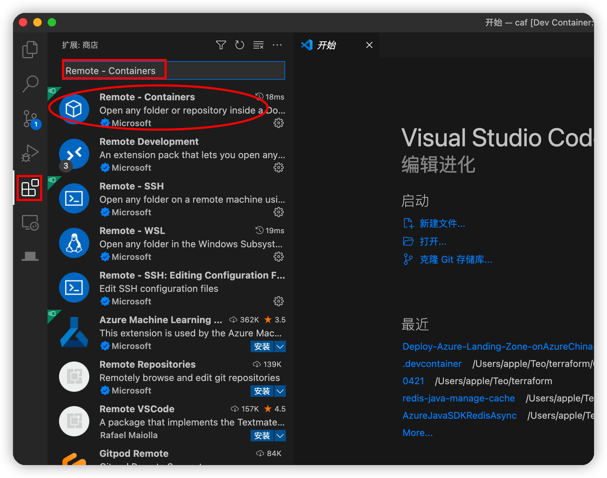

9.  在VS code顶部，单击查看-\>命令面板

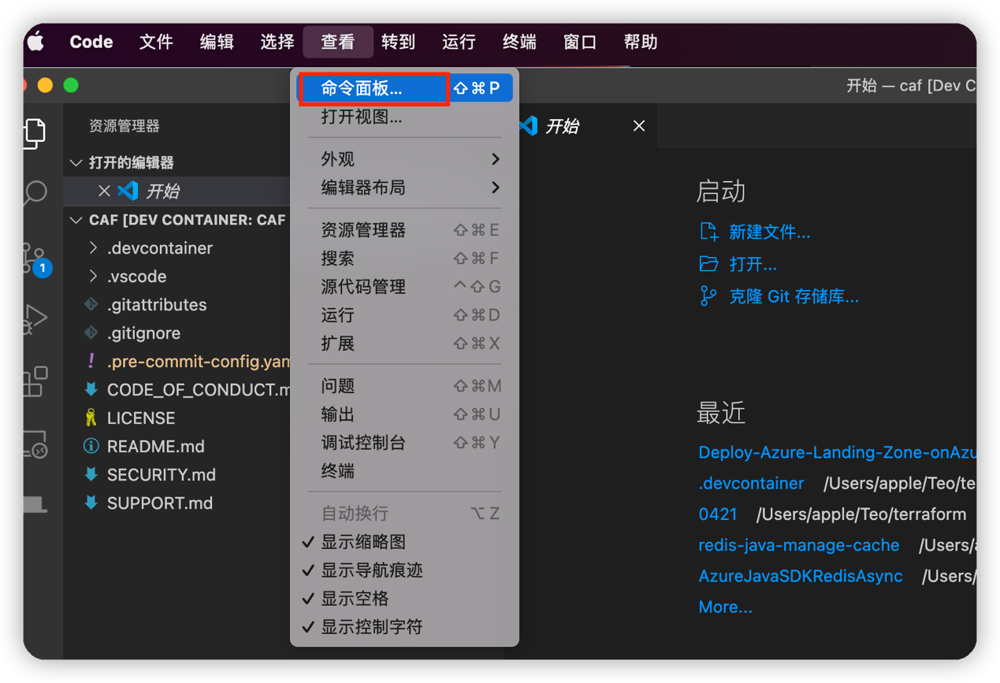

10. 输入Remote-Containers，点击它。Rover容器将被启动。


11. 您现在应该看到以下终端（Terminal）。您将在此终端运行本实验中描述的所有终端命令。

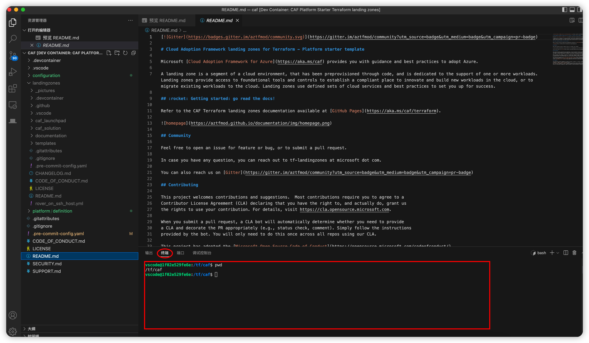

12. 克隆 CAF Terraformlandingzones[代码](https://aztfmod.github.io/documentation/docs/azure-landing-zones/landingzones/platform/org-setup#clone-the-caf-terraform-landingzones-code)。现在您已经准备好使用配置文件夹，让我们克隆我们将用于运行命令的登陆区的逻辑（Terraform
    代码）。
    **注意：**CAF Terraform Landing Zone框架假定Landing Zone Terraform代码被克隆到名为**landingzones**的存储库中。不要使用其他名称作**landingzones**，这是用于驱动一致性的约定。

    Github:

    ```bash
    git clone https://github.com/Azure/caf-terraform-landingzones.git landingzones
    ```


    Gitee:

    ```bash
    git clone https://gitee.com/teo-ma/caf-terraform-landingzones.git landingzones
    ```

    看到代码正在被clone到**landingzones目录**

    Cloning into \'landingzones\'\...\
    remote: Enumerating objects: 9067, done.\
    remote: Counting objects: 100% (393/393), done.\
    remote: Compressing objects: 100% (281/281), done.\
    remote: Total 9067 (delta 161), reused 295 (delta 108), pack-reused
    8674\
    Receiving objects: 100% (9067/9067), 11.65 MiB \| 6.83 MiB/s, done.\
    Resolving deltas: 100% (5792/5792), done.\
    Updating files: 100% (406/406), done.

13. 进入landingzones目录，请注意，所有文件夹都以 devcontainers 中的/tf/caf 开头。

    \# caf git:(main) ✗ cd landingzones\
    ➜ landingzones git:(main) ✗ pwd\
    /tf/caf/landingzones\
    ➜ landingzones git:(main) ✗

14. CAF Terraform 登陆区会定期发布。为了对齐部署说明，您需要确保Terraform代码也使用正确的分支或标记。在终端中，运行以下命令来选择分支,以便切换到选定的landingzones版本

    ```bash
    git checkout 2203.0
    ```

    Note: switching to \'2203.0\'.\
    \
    You are *in* \'detached HEAD\' state. You can look around, make
    experimental\
    changes and commit them, and you can discard any commits you make *in*
    this\
    state without impacting any branches by switching back to a branch.

## 动手实验

1.  本实验的目的是让您开始使用单订阅环境，该环境将部署全部功能，并允许您试验LandingZone机制和跨状态组合。它将创建一个平台定义，然后您可以根据需要进行自定义，向您显示具有生产和非生产环境的单个Azure 区域。

2.  第一步是在命令行登录到你的 Azure 环境，你可以简单地运行

  **注意**：本动手实验文档默认按Azure Global环境运行，Rover支持AzureGlobal和AzureChina（世纪互联）等所有Azure公有云，在rover命令行登陆azure之前需要设置所使用的云环境

  **Azure Global ：**

    ```bash
        az cloud set -n AzureCloud
    ```
  **Azure China ：**

    ```bash
        az cloud set -n AzureChinaCloud
    ```

    通过命令行运行rover login登录Azure

    ```bash
    rover login
    ```

单击URL [[https://microsoft.com/devicelogin]{.underline}](https://microsoft.com/devicelogin)，设置代码并使用您的Azure 帐户进行身份验证。


3.  登录成功后，您会看到Rover显示您的 Azure环境的上下文。验证一切是否正确。您可以查看Rover输出，确认AAD和订阅的经过身份验证的上下文，以及可能的下一个命令。


4.  现在让我们从landingzones中选择正确的配置文件示例并将其放入我们的配置存储库中。只需运行以下命令：

    ```bash
    '/tf/caf/landingzones/templates/platform/deploy_platform.sh'
    ```

5.  第一次运行该命令时，系统会提示您几个简单的问题，如下所示：

    \[WARNING\]: No inventory was parsed, only implicit localhost is
    available\
    \[WARNING\]: provided hosts list is empty, only localhost is available.
    Note that the implicit localhost does not match \'all\'\
    Set the short version of your customer name with no spaces \[contoso\]:\
    Set the CAF Environment value \[contoso\]:\
    Set the prefix to add to all resource. \[caf\]:\
    Management group prefix (value must be between 2 to 10 characters long
    and can only contain alphanumeric characters and hyphens). \[es\]:\
    Management group name \[Contoso\]:\
    Email address to send all notifications \[email\@address.com\]:\
    Azure regions (lowercase, short version) \[{\'region1\':
    \'southeastasia\', \'region2\': \'eastasia\'}\]:\
    Default CAF Azure region key \[region1\]:

6.  完成后，您可以转到launchpad readme文件。


7.  查看和客户化定义文件 **/tf/caf/platform/definition/GETTING-STARTED.md** 现在生成定义文件。它包含一组 YAML 文件，可以让您轻松入门。


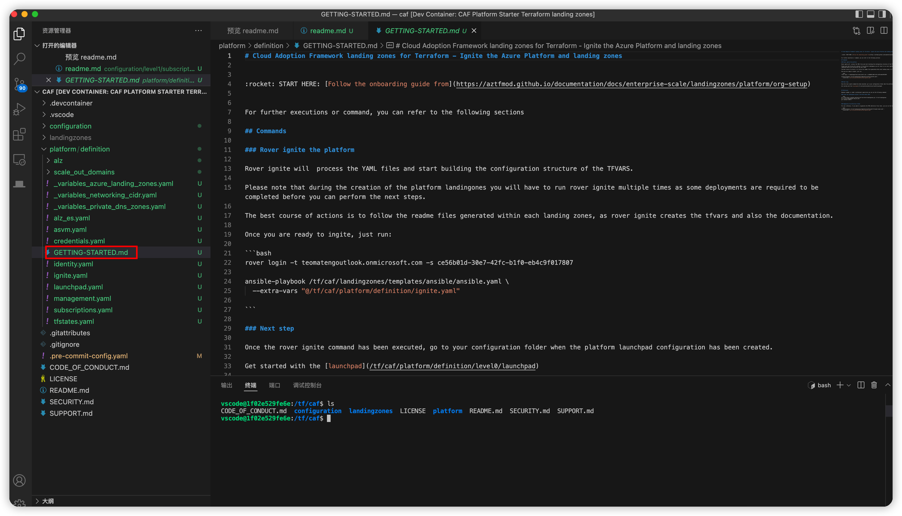

8.  触发rover ignite

    完成此步骤后，您必须遵循存储库( **/tf/caf/platform/definition/GETTING-STARTED.md** ) 中的 readme.md并按照说明进行操作。使用 rover ignite 生成 Terraform配置文件和自定义自述文件的第一步：

    ```bash
    ansible-playbook /tf/caf/landingzones/templates/ansible/ansible.yaml --extra-vars "@/tf/caf/platform/definition/ignite.yaml"
    ```
        rover ignite 的输出将开始创建目标配置文件夹结构和 Terraform文件，如下所示：

        TASK \[\[level0-launchpad\] Clean-up directory\]
        \*\*\*\*\*\*\*\*\*\*\*\*\*\*\*\*\*\*\*\*\*\*\*\*\*\*\*\*\*\*\*\*\*\*\*\*\*\*\*\*\*\*\*\*\*\*\*\*\*\*\*\*\*\*\*\*\*\*\*\*\*\
        skipping: \[localhost\]\
        \
        TASK \[\[level0-launchpad\] Creates directory\]
        \*\*\*\*\*\*\*\*\*\*\*\*\*\*\*\*\*\*\*\*\*\*\*\*\*\*\*\*\*\*\*\*\*\*\*\*\*\*\*\*\*\*\*\*\*\*\*\*\*\*\*\*\*\*\*\*\*\*\*\*\*\*\
        changed: \[localhost\]\
        \
        TASK \[\[level0-launchpad\] - resources - resource_groups\]
        \*\*\*\*\*\*\*\*\*\*\*\*\*\*\*\*\*\*\*\*\*\*\*\*\*\*\*\*\*\*\*\*\*\*\*\*\*\*\*\*\*\*\*\*\*\*\*\*\*\*\
        changed: \[localhost\] =>
        (item=/tf/caf/landingzones/templates/resources/resource_groups.tfvars.j2)\
        \
        TASK \[\[level0-launchpad\] launchpad\]
        \*\*\*\*\*\*\*\*\*\*\*\*\*\*\*\*\*\*\*\*\*\*\*\*\*\*\*\*\*\*\*\*\*\*\*\*\*\*\*\*\*\*\*\*\*\*\*\*\*\*\*\*\*\*\*\*\*\*\*\*\*\*\*\*\*\*\*\*\*\*\
        changed: \[localhost\] => (item=dynamic_secrets)\
        changed: \[localhost\] => (item=global_settings)\
        changed: \[localhost\] => (item=keyvaults)\
        changed: \[localhost\] => (item=landingzone)\
        changed: \[localhost\] => (item=role_mappings)\
        changed: \[localhost\] => (item=storage_accounts)\
        \
        TASK \[\[level0-launchpad\] Clean-up identity files\]
        \*\*\*\*\*\*\*\*\*\*\*\*\*\*\*\*\*\*\*\*\*\*\*\*\*\*\*\*\*\*\*\*\*\*\*\*\*\*\*\*\*\*\*\*\*\*\*\*\*\*\*\*\*\*\*\*\
        skipping: \[localhost\] => (item=azuread_api_permissions)\
        skipping: \[localhost\] => (item=azuread_applications)\
        skipping: \[localhost\] => (item=azuread_group_members)\
        skipping: \[localhost\] => (item=azuread_groups)\
        skipping: \[localhost\] => (item=azuread_roles)\
        skipping: \[localhost\] => (item=keyvault_policies)\
        skipping: \[localhost\] => (item=service_principals)\
        \
        TASK \[\[level0-launchpad\] lauchpad - identity - service_principal\]
        \*\*\*\*\*\*\*\*\*\*\*\*\*\*\*\*\*\*\*\*\*\*\*\*\*\*\*\*\*\*\*\*\*\*\*\*\*\*\*\*\
        changed: \[localhost\] => (item=azuread_api_permissions)\
        changed: \[localhost\] => (item=azuread_applications)\
        changed: \[localhost\] => (item=azuread_group_members)\
        changed: \[localhost\] => (item=azuread_groups)\
        changed: \[localhost\] => (item=azuread_roles)\
        changed: \[localhost\] => (item=keyvault_policies)\
        changed: \[localhost\] => (item=service_principals)\
        \
        TASK \[\[level0-launchpad\] Deploy the launchpad\]
        \*\*\*\*\*\*\*\*\*\*\*\*\*\*\*\*\*\*\*\*\*\*\*\*\*\*\*\*\*\*\*\*\*\*\*\*\*\*\*\*\*\*\*\*\*\*\*\*\*\*\*\*\*\*\*\*\*\*\*\
        skipping: \[localhost\]\
        \
        TASK \[\[level0-launchpad\] Get tfstate account name\]
        \*\*\*\*\*\*\*\*\*\*\*\*\*\*\*\*\*\*\*\*\*\*\*\*\*\*\*\*\*\*\*\*\*\*\*\*\*\*\*\*\*\*\*\*\*\*\*\*\*\*\*\*\*\*\*\
        changed: \[localhost\]

        **注意：** 在第一次执行 rover ignite命令时，您会注意到一些红色错误。这是可以预料的，因为rover ignite正在尝试寻找launchpad和已部署的服务。但目前尚未部署任何东西。

        TASK \[\[level0-launchpad\] Get launchpad tfstate details\]
        \*\*\*\*\*\*\*\*\*\*\*\*\*\*\*\*\*\*\*\*\*\*\*\*\*\*\*\*\*\*\*\*\*\*\*\*\*\*\*\*\*\*\*\*\*\*\*\*\*\*\
        fatal: \[localhost\]: FAILED! => {\"changed\": true, \"cmd\": \"az
        storage blob download \--name \\\"caf_launchpad.tfstate\\\"
        \--account-name \\\"\\\" \--container-name \\\"tfstate\\\" \--auth-mode
        \\\"login\\\" \--file
        \\\"\~/.terraform.cache/launchpad/caf_launchpad.tfstate\\\"\\n\",
        \"delta\": \"0:00:01.796026\", \"end\": \"2022-01-20 10:12:52.623103\",
        \"msg\": \"non-zero return code\", \"rc\": 1, \"start\": \"2022-01-20
        10:12:50.827077\", \"stderr\": \"ERROR: \\nMissing credentials to access
        storage service. The following variations are accepted:\\n (1) account
        name and key (\--account-name and \--account-key options or\\n set
        AZURE_STORAGE_ACCOUNT and AZURE_STORAGE_KEY environment variables)\\n
        (2) account name and SAS token (\--sas-token option used with either the
        \--account-name\\n option or AZURE_STORAGE_ACCOUNT environment
        variable)\\n (3) account name (\--account-name option or
        AZURE_STORAGE_ACCOUNT environment variable;\\n this will make calls to
        query for a storage account key using login credentials)\\n (4)
        connection string (\--connection-string option or\\n set
        AZURE_STORAGE_CONNECTION_STRING environment variable); some shells will
        require\\n quoting to preserve literal character interpretation.\",
        \"stderr_lines\": \[\"ERROR: \", \"Missing credentials to access storage
        service. The following variations are accepted:\", \" (1) account name
        and key (\--account-name and \--account-key options or\", \" set
        AZURE_STORAGE_ACCOUNT and AZURE_STORAGE_KEY environment variables)\", \"
        (2) account name and SAS token (\--sas-token option used with either the
        \--account-name\", \" option or AZURE_STORAGE_ACCOUNT environment
        variable)\", \" (3) account name (\--account-name option or
        AZURE_STORAGE_ACCOUNT environment variable;\", \" this will make calls
        to query for a storage account key using login credentials)\", \" (4)
        connection string (\--connection-string option or\", \" set
        AZURE_STORAGE_CONNECTION_STRING environment variable); some shells will
        require\", \" quoting to preserve literal character interpretation.\"\],
        \"stdout\": \"\", \"stdout_lines\": \[\]}\
        \...ignoring\
        \
        TASK \[\[level0-launchpad\] Get subscription_creation_landingzones
        details\]
        \*\*\*\*\*\*\*\*\*\*\*\*\*\*\*\*\*\*\*\*\*\*\*\*\*\*\*\*\*\*\*\*\*\
        skipping: \[localhost\]

9.  部署launchpad（level0 ）。转到/tf/caf/configuration/contoso/platform/level0/launchpad/readme.md

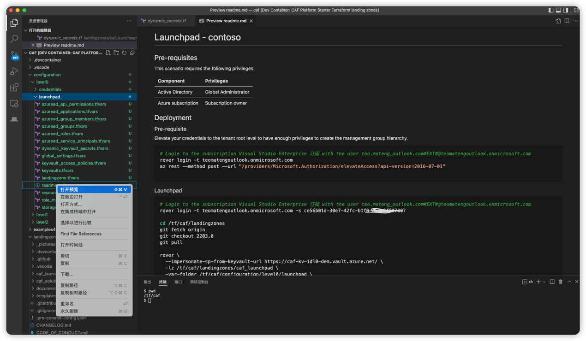

   在**readme**中您会看到基于你的Azure环境生成了客户化的landin zone部署命令和解释说明，根据readme描述提示，一步接一步的运行命令进行部署。

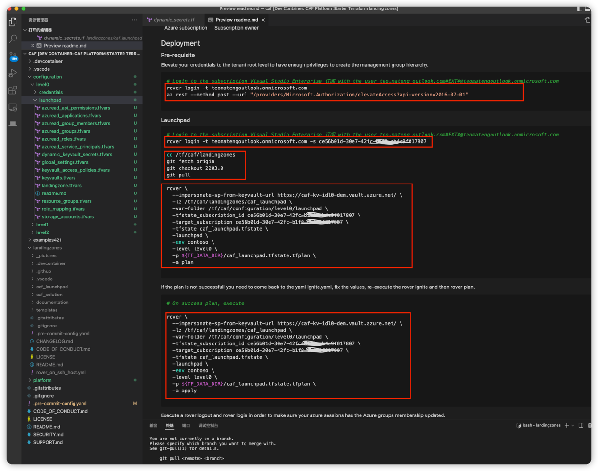

**注意：**每次通过rover命令执行正式部署（-a apply）前,要先通过rover xxxxxx **-a plan**命令进行环境检查和部署变化，以便确保部署成功和预先了解部署前后状态变化。观测下面两个Rover命令的参数变化：

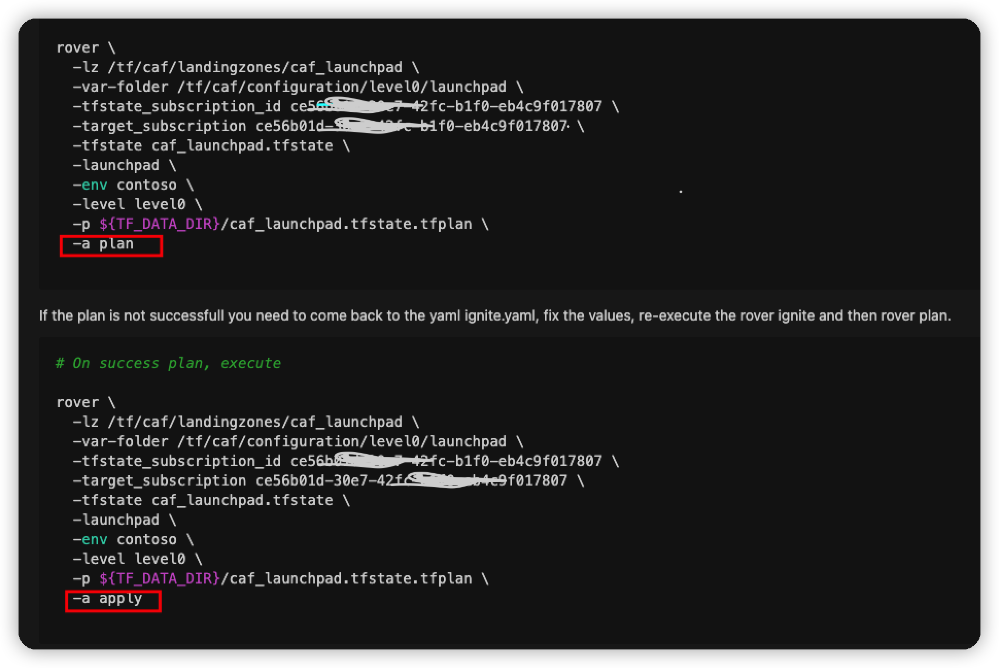

10. 运行 rover xxxxxxx **-a plan**命令，第一次执行过程可能需要10分钟甚至更长时间，期间会检查Azure账户信息，环境状态信息和部署前后变化等，以及所需依赖包及版本，需要的话可能会下载相应的依赖包。


11. **plan**命令成功结束后，观察输出的文本信息，可以看到部署前后将会产生的变化信息：

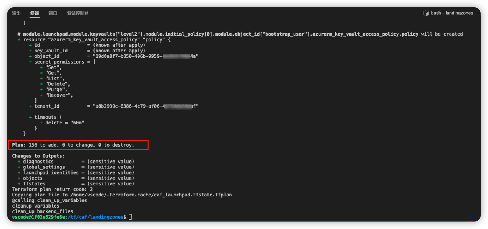

12. 接下来正式通过apply 执行部署landing zone launchpad

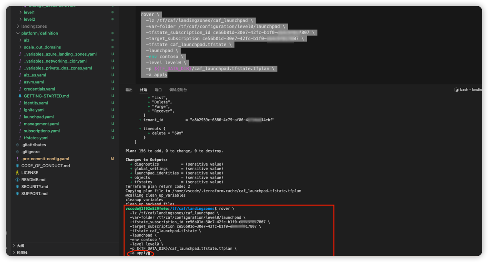

13. **apply**命令成功结束后，观察输出的文本信息，可以看到部署前后将会产生的变化信息：

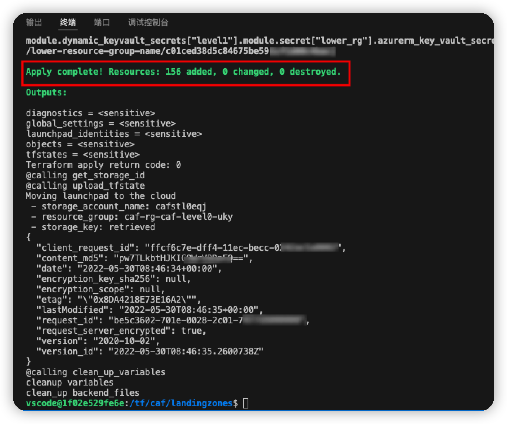

14. 登录AzurePortal，观测生成的资源组和资源信息，生成了3个资源组，每个资源组含有一个Keyvault和Storage account，用于保存身份信息和存储部署状态信息，目前这些资源仅仅用于landing
    zone管理，并不含有客户业务系统的workload资源。

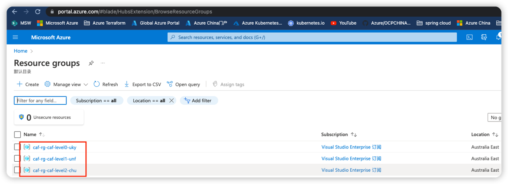

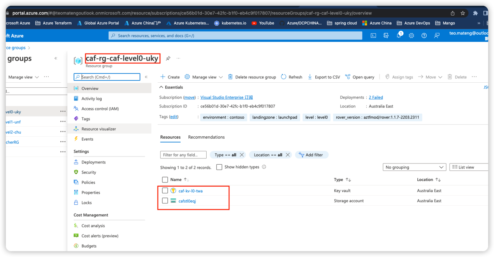

15. 每个部署的readme文件在完成了相应部分的部署操作后，都会提示下一步操作，按readme中指引的Next
    Step完成之后的操作任务。当完成level2后，所需的企业级landing
    zone部署基本就绪了。Partner和客户可以在这之上继续使用Azrue
    Terraform部署应用worklaod。

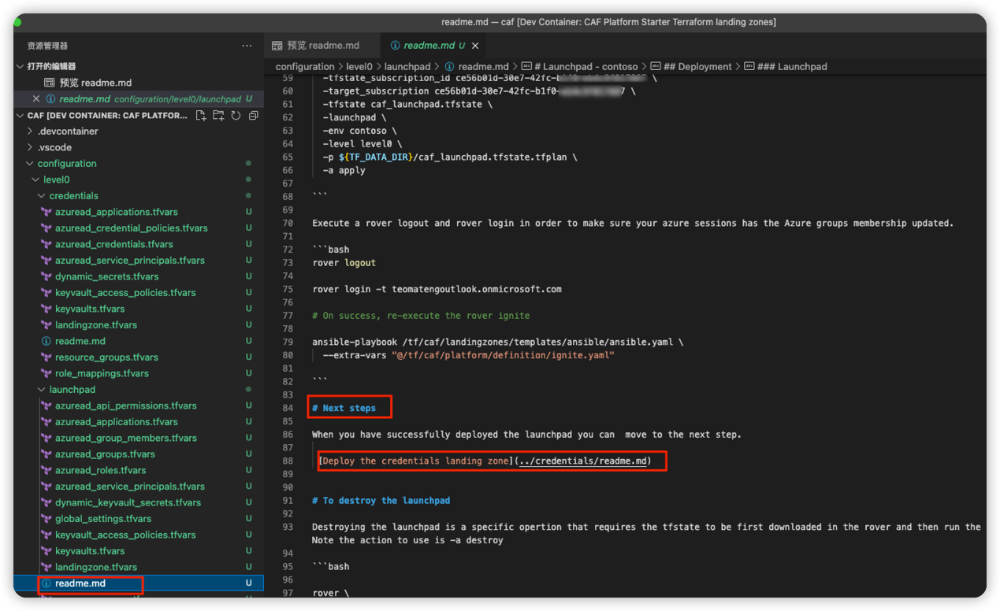

16. 上面实验中，通过Azure Terraform Rover完成了Landing Zone的部署，即：

    > Level 0： Lauchpad，
    >
    > Level 1 ：管理、身份，然后是 alz。完成第 1 级后，
    >
    > Level 2: Azure 订阅自动售货机 (asvm) 和身份，以及使用虚拟WAN的连接组件。

&nbsp;
&nbsp;

## 考虑

   接下来，Partner可以通过生成的tfvar变量及rover命令近一步理解Azure Terraform Provider/Azure Terraform Module/Rover/RoverIgnite逻辑关系，并尝试部署你客户业务场景中所需的上层应用workload，比如IaaS（VM，存储等），PaaS（Mysql，Web Apps等)。
   &nbsp;
   近一步学习和使用Azure Landing Zone for Terraform还可以参考如下资源：

   [Azure Landing Zone](https://docs.microsoft.com/zh-cn/azure/cloud-adoption-framework/ready/landing-zone/)

   [Terraform语言](https://www.terraform.io/language)

   [Cloud Adoption Framework for Terraform Landing zones](https://aztfmod.github.io/documentation/)

   [CAF Landing Zone Starter](https://github.com/Azure/caf-terraform-landingzones-starter)

   [Azure - Terraform landing zones module and solutions](https://github.com/aztfmod/terraform-azurerm-caf)
